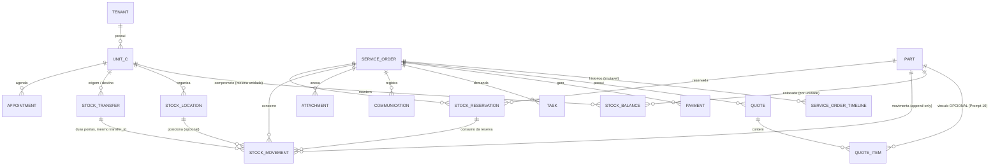

# ERD — Nexo56

Diagrama versionável em Mermaid (Prompt 02, item 83).

**Duas seções distintas:** o que existe fisicamente no banco e o que ainda é
apenas modelo conceitual.

---

## 1. Schema atual (implementado e migrado)

```mermaid
erDiagram
    PLANS ||--o{ PLAN_ENTITLEMENTS : libera
    FEATURES ||--o{ PLAN_ENTITLEMENTS : consta_em
    FEATURES ||--o{ FEATURE_DEPENDENCIES : depende
    FEATURES ||--o{ TENANT_FEATURES : configurada
    FEATURES ||--o{ PERMISSIONS : agrupa

    PLANS ||--o{ TENANTS : contratado_por
    TENANTS ||--o{ UNITS : possui
    TENANTS ||--o{ USERS : possui
    TENANTS ||--o{ ROLES : define
    TENANTS ||--o{ TENANT_FEATURES : ativa
    TENANTS ||--o{ TENANT_SEQUENCES : numera
    TENANTS ||--o{ AUDIT_LOGS : registra
    TENANTS ||--o{ DOMAIN_EVENTS : emite
    TENANTS ||--o{ JOBS : agenda

    USERS ||--o{ SESSIONS : autentica
    USERS ||--o{ USER_UNITS : autorizado_em
    UNITS ||--o{ USER_UNITS : autoriza
    USERS ||--o{ USER_ROLES : possui
    ROLES ||--o{ USER_ROLES : atribuido
    USERS ||--o{ USER_UNIT_ROLES : possui_na_unidade
    ROLES ||--o{ USER_UNIT_ROLES : atribuido_na_unidade
    UNITS ||--o{ USER_UNIT_ROLES : delimita
    USER_UNITS ||--o{ USER_UNIT_ROLES : exigido_por
    ROLES ||--o{ ROLE_PERMISSIONS : concede
    PERMISSIONS ||--o{ ROLE_PERMISSIONS : concedida
    USERS ||--o{ PASSWORD_RESET_TOKENS : redefine

    TENANTS ||--o{ CUSTOMERS : possui
    CUSTOMERS ||--o{ CUSTOMER_CONTACTS : tem
    CUSTOMERS ||--o{ CUSTOMER_ADDRESSES : tem
    CUSTOMERS ||--o{ EQUIPMENT : "possui (tenant, nao unidade)"
    EQUIPMENT ||--o{ EQUIPMENT_INTAKES : "recebido em"
    UNITS ||--o{ EQUIPMENT_INTAKES : "aconteceu na unidade"
    EQUIPMENT_INTAKES ||--o{ EQUIPMENT_INTAKE_ACCESSORIES : acompanha
    EQUIPMENT_INTAKES ||--o{ EQUIPMENT_INTAKE_CONDITIONS : inspeciona
    EQUIPMENT ||--o{ EQUIPMENT_MEDIA : fotografado
    EQUIPMENT_INTAKES ||--o{ EQUIPMENT_MEDIA : "foto do atendimento"
    EQUIPMENT ||--o{ EQUIPMENT_LABEL_READINGS : "etiqueta lida"

    CUSTOMERS ||--o{ SERVICE_ORDERS : solicita
    EQUIPMENT ||--o{ SERVICE_ORDERS : atendido_em
    UNITS ||--o{ SERVICE_ORDERS : "executa (unit_id OBRIGATORIO)"
    EQUIPMENT_INTAKES ||--o| SERVICE_ORDERS : "origina (1:1)"
    SERVICE_ORDERS ||--o{ SERVICE_ORDER_TIMELINE : "historico (append-only)"

    TENANTS {
        char36 id PK
        varchar slug UK
        varchar name
        enum status
        varchar timezone
        char36 plan_id FK
    }
    UNITS {
        char36 id PK
        char36 tenant_id FK
        varchar name
        enum status
        varchar timezone "nulo herda do tenant"
        composite uq_units_id_tenant UK "alvo de FK composta"
    }
    USERS {
        char36 id PK
        char36 tenant_id FK
        varchar email "unico por tenant"
        varchar password_hash "scrypt"
        enum status
        composite uq_users_id_tenant UK "alvo de FK composta"
    }
    USER_UNITS {
        char36 user_id PK_FK "FK composta com tenant_id"
        char36 unit_id PK_FK "FK composta com tenant_id"
        char36 tenant_id FK
    }
    SESSIONS {
        char36 id PK
        char36 user_id FK "FK composta com tenant_id"
        char36 tenant_id FK
        varchar token_hash UK "SHA-256, nunca o token"
        datetime expires_at
        datetime revoked_at
        varchar user_agent_summary "resumo curto, sem IP"
    }
    ROLES {
        char36 id PK
        char36 tenant_id FK
        varchar key "unico por tenant"
        boolean is_system
        composite uq_roles_id_tenant UK "alvo de FK composta"
    }
    USER_ROLES {
        char36 user_id PK_FK "FK composta com tenant_id"
        char36 role_id PK_FK "FK composta com tenant_id"
        char36 tenant_id FK
        escopo TENANT "vale nas unidades que o usuario acessa"
    }
    USER_UNIT_ROLES {
        char36 user_id PK_FK "FK composta com tenant_id e com unit_id"
        char36 role_id PK_FK "FK composta com tenant_id"
        char36 unit_id PK_FK "FK composta com tenant_id"
        char36 tenant_id FK
        escopo UNIT "vale SO nesta unidade; exige vinculo"
    }
    PASSWORD_RESET_TOKENS {
        char36 id PK
        char36 user_id FK "FK composta com tenant_id"
        char36 tenant_id FK
        varchar token_hash UK "SHA-256, nunca o codigo"
        datetime expires_at "60 minutos"
        datetime used_at "uso unico"
    }
    PERMISSIONS {
        varchar key PK "catalogo GLOBAL"
        varchar feature_key FK
    }
    ROLE_PERMISSIONS {
        char36 role_id PK_FK
        varchar permission_key PK_FK
    }
    FEATURES {
        varchar key PK "catalogo GLOBAL"
        enum type "CORE OPTIONAL PREMIUM BETA INTERNAL"
        enum status
    }
    FEATURE_DEPENDENCIES {
        varchar feature_key PK_FK
        varchar depends_on_key PK_FK
    }
    PLANS {
        char36 id PK "catalogo GLOBAL"
        varchar key UK
        boolean is_internal
    }
    PLAN_ENTITLEMENTS {
        char36 plan_id PK_FK
        varchar feature_key PK_FK
    }
    TENANT_FEATURES {
        char36 tenant_id PK_FK
        varchar feature_key PK_FK
        boolean enabled "desativar NAO apaga dados"
        datetime enabled_at
        datetime disabled_at
    }
    TENANT_SEQUENCES {
        char36 tenant_id PK_FK
        varchar sequence_type PK "service_order quote..."
        bigint current_value "numeracao humana por tenant"
        varchar prefix
        int padding
    }
    AUDIT_LOGS {
        char36 id PK
        char36 tenant_id FK
        char36 user_id
        varchar action
        json before
        json after
        char36 correlation_id
    }
    DOMAIN_EVENTS {
        char36 id PK
        char36 tenant_id FK
        varchar type
        json payload
        datetime published_at "nulo = pendente (outbox)"
    }
    JOBS {
        char36 id PK
        varchar name
        char36 tenant_id FK
        varchar idempotency_key UK
        enum status
        int attempts
    }
    CUSTOMERS {
        char36 id PK
        char36 tenant_id FK
        enum kind "individual company"
        varchar name
        varchar name_normalized "busca"
        varchar document_digits UK "unico por tenant quando presente"
        enum status
        char36 origin_unit_id "procedencia, NUNCA filtro"
        composite uq_customers_id_tenant UK "alvo de FK composta"
    }
    CUSTOMER_CONTACTS {
        char36 id PK
        char36 customer_id FK "FK composta com tenant_id"
        char36 tenant_id FK
        enum type "phone email"
        varchar value_normalized "busca"
        tinyint primary_marker UK "1 no principal, NULL nos demais"
    }
    CUSTOMER_ADDRESSES {
        char36 id PK
        char36 customer_id FK "FK composta com tenant_id"
        char36 tenant_id FK
        tinyint primary_marker UK "um unico principal"
    }
    EQUIPMENT {
        char36 id PK
        char36 tenant_id FK
        char36 customer_id FK "FK composta com tenant_id"
        varchar kind "texto livre com sugestoes"
        varchar brand
        varchar model "sem normalizacao destrutiva"
        varchar serial "OPCIONAL, sem unicidade"
        enum voltage "v110 v127 v220 bivolt not_applicable unknown"
        enum status
        char36 origin_unit_id "procedencia, NUNCA filtro"
        composite uq_equipment_id_tenant UK "alvo de FK composta"
    }
    EQUIPMENT_INTAKES {
        char36 id PK
        char36 tenant_id FK
        char36 unit_id FK "OBRIGATORIO, da sessao - FK composta"
        char36 equipment_id FK "FK composta com tenant_id"
        datetime received_at
        char36 received_by
        enum power_cable "yes no not_applicable"
        text inspection_notes "estado de entrada, NAO diagnostico"
        composite uq_intake_id_tenant UK "alvo de FK composta"
    }
    EQUIPMENT_INTAKE_ACCESSORIES {
        char36 id PK
        char36 intake_id FK "FK composta com tenant_id"
        varchar label "texto livre"
        int quantity "INTEIRA"
    }
    EQUIPMENT_INTAKE_CONDITIONS {
        char36 id PK
        char36 intake_id FK "FK composta com tenant_id"
        varchar condition_key UK "unico por recebimento"
        varchar note
    }
    EQUIPMENT_MEDIA {
        char36 id PK
        char36 tenant_id FK
        char36 equipment_id FK "FK composta com tenant_id"
        char36 intake_id FK "nulo = foto do cadastro"
        enum kind "label serial damage front back..."
        varchar storage_key "chave opaca; bytes FORA do banco"
        varchar checksum "SHA-256"
        composite uq_media_id_tenant UK "alvo de FK composta"
    }
    EQUIPMENT_LABEL_READINGS {
        char36 id PK
        char36 tenant_id FK
        char36 equipment_id FK "FK composta com tenant_id"
        varchar provider "none = indisponivel (padrao hoje)"
        enum status "succeeded partial failed unavailable"
        json fields "sugestao; NUNCA sobrescreve o confirmado"
        datetime confirmed_at "confirmacao HUMANA"
    }
    SERVICE_ORDERS {
        char36 id PK
        char36 tenant_id FK
        char36 unit_id FK "OBRIGATORIO, da sessao - FK composta"
        int number UK "numero humano, unico por TENANT"
        char36 customer_id FK "FK composta com tenant_id"
        char36 equipment_id FK "FK composta com tenant_id"
        char36 intake_id UK "nulo = sem recebimento; FK composta com tenant_id E com unit_id"
        varchar status "um dos nove estados do workflow; varchar, nunca ENUM"
        text customer_report "o que o CLIENTE disse - nao e diagnostico"
        text internal_notes "recado da equipe, nao vai ao cliente"
        datetime opened_at
        varchar idempotency_key UK "mesmo comando, mesma OS"
        datetime status_changed_at "P08 - instante da ultima transicao"
        int version "P08 - concorrencia otimista, compare-and-swap"
        char36 assigned_technician_id FK "P08 - FK composta com tenant_id"
        varchar follow_up_at "P08 - DATA CIVIL no fuso da empresa, nao instante"
        varchar follow_up_alerted_for "P08 - prazo que ja gerou evento"
        composite uq_service_order_id_tenant UK "alvo de FK composta"
    }
    SERVICE_ORDER_TIMELINE {
        char36 id PK
        char36 tenant_id FK
        char36 service_order_id FK "FK composta com tenant_id"
        varchar kind "nove tipos; texto, para crescer sem migration"
        varchar summary "sem PII"
        json metadata "sem PII - so chaves tecnicas"
        varchar reason "P08 - justificativa escrita da transicao"
        char36 actor_id
        datetime occurred_at
    }
    SERVICE_ORDER_TASKS {
        char36 id PK
        char36 tenant_id FK
        char36 unit_id FK "unidade da ordem - FK composta"
        char36 service_order_id FK "FK composta, ON DELETE CASCADE"
        varchar kind "delivery_preparation part_pickup - NAO e situacao da OS"
        varchar title "texto oficial, lido na bancada"
        varchar description "em part_pickup: texto livre"
        char36 assignee_id FK "nulo quando quem abriu perdeu acesso"
        varchar due_date "DATA CIVIL no fuso da empresa"
        varchar status "open done cancelled"
        tinyint open_marker UK "1 enquanto aberta, NULL depois"
        datetime completed_at
        char36 completed_by
    }
    QUOTES {
        char36 id PK
        char36 tenant_id FK
        char36 unit_id FK "da OS - sustenta a FK composta com service_order_id"
        char36 service_order_id FK "FK composta com tenant_id E com unit_id"
        int number "numero humano, sequencia do TENANT"
        int revision "revisao e LINHA NOVA com o mesmo numero"
        char36 supersedes_quote_id FK "a versao que esta revisao substitui"
        varchar status "draft sent approved rejected expired superseded cancelled"
        tinyint active_marker UK "1 enquanto viva, NULL depois - uma por OS"
        tinyint approved_marker UK "1 so na aprovada - uma por OS"
        decimal subtotal "DECIMAL(14,2) - calculado no backend"
        decimal discount "desconto em VALOR, nunca percentual"
        decimal total "subtotal - desconto"
        varchar currency "BRL - sem multimoeda"
        varchar valid_until "DATA CIVIL no fuso da empresa; nulo = sem prazo"
        text customer_notes "o cliente vera"
        text internal_notes "recado da equipe, nao vai ao cliente"
        datetime sent_at "formalizado - NENHUMA mensagem foi enviada"
        datetime decided_at
        varchar decision_source "hoje sempre internal - nao ha Portal"
        varchar decision_reason "motivo da recusa, texto livre"
        int version "concorrencia otimista"
        varchar idempotency_key UK "mesmo comando, mesmo orcamento"
        composite uq_quote_id_tenant UK "alvo de FK composta"
    }
    QUOTE_ITEMS {
        char36 id PK
        char36 tenant_id FK
        char36 quote_id FK "FK composta, ON DELETE CASCADE"
        varchar kind "service part other"
        char36 part_id FK "Prompt 10: vinculo OPCIONAL e ANULAVEL com parts"
        varchar description "obrigatoria, texto livre, sem catalogo"
        decimal quantity "DECIMAL(14,4) - meia hora e 0.5"
        decimal unit_price "DECIMAL(14,2) - lido pelo Money, nunca float"
        decimal discount "desconto da linha, em valor"
        decimal total "round(qtd x unitario) - desconto"
        int position "ordem de exibicao"
    }
    QUOTE_TIMELINE {
        char36 id PK
        char36 tenant_id FK
        char36 quote_id FK "FK composta, ON DELETE CASCADE"
        varchar kind "created items_updated sent approved rejected..."
        varchar summary "sem PII"
        json metadata "sem PII - so chaves tecnicas"
        varchar reason "motivo escrito, texto livre"
        char36 actor_id
        datetime occurred_at
    }

    PARTS ||--o{ STOCK_BALANCES : "estocada por unidade"
    PARTS ||--o{ STOCK_MOVEMENTS : movimenta
    PARTS ||--o{ STOCK_RESERVATIONS : reservada
    PARTS ||--o{ STOCK_TRANSFERS : transferida
    PARTS ||--o{ QUOTE_ITEMS : "vinculo OPCIONAL e anulavel"
    UNITS ||--o{ STOCK_LOCATIONS : organiza
    STOCK_LOCATIONS ||--o{ STOCK_MOVEMENTS : "posiciona (opcional)"
    STOCK_LOCATIONS ||--o{ STOCK_BALANCES : "localizacao preferida"
    SERVICE_ORDERS ||--o{ STOCK_MOVEMENTS : "consome (FK com unit_id)"
    SERVICE_ORDERS ||--o{ STOCK_RESERVATIONS : "compromete (FK com unit_id)"
    STOCK_RESERVATIONS ||--o{ STOCK_MOVEMENTS : "consumo da reserva"
    STOCK_TRANSFERS ||--o{ STOCK_MOVEMENTS : "duas pontas, mesmo transfer_id"

    PARTS {
        char36 id PK
        char36 tenant_id FK "TENANT - a peca e da empresa, nao da loja"
        varchar code "codigo interno como foi digitado"
        varchar code_normalized UK "unico por tenant - compacto e maiusculo"
        varchar name
        varchar name_search "sem acento, minusculo - chave de busca"
        varchar brand "texto livre - nao ha catalogo de marcas"
        varchar part_number "SEM unicidade - fabricantes reusam"
        varchar barcode "SEM presumir EAN - nao ha leitor ainda"
        varchar unit_of_measure "unit package meter gram kilogram liter"
        decimal suggested_price "informacao comercial - nao e o preco aprovado"
        varchar status "active inactive - inativar NAO apaga nada"
        int version "concorrencia otimista"
    }
    STOCK_LOCATIONS {
        char36 id PK
        char36 tenant_id FK
        char36 unit_id FK "UNIDADE - prateleira nao atravessa loja"
        varchar name "nome que a loja escolheu - nao ha enum"
        varchar code_normalized UK "unico DENTRO da unidade"
        varchar status "active inactive"
        composite uq_stock_location_id_unit UK "alvo de FK composta"
    }
    STOCK_BALANCES {
        char36 id PK
        char36 tenant_id FK
        char36 unit_id FK "UNIDADE - quantidade tem lugar"
        char36 part_id FK "FK composta com tenant_id"
        decimal on_hand "fisico, INCLUINDO o que ja tem dono - CHECK >= 0"
        decimal reserved "comprometido - CHECK >= 0 e <= on_hand"
        decimal minimum_quantity "por peca E por unidade - zero desliga"
        decimal average_cost "media ponderada movel - NULL enquanto sem custo"
        char36 primary_location_id FK "resumo da listagem"
        datetime low_stock_alerted_at "marca que impede republicar o alerta"
        int version
        composite uq_stock_balance_unit_part UK "um saldo por peca por unidade"
    }
    STOCK_MOVEMENTS {
        char36 id PK "APPEND-ONLY - sem updated_at, sem version"
        char36 tenant_id FK
        char36 unit_id FK
        char36 part_id FK
        char36 location_id FK "opcional - FK composta com unit_id"
        varchar type "receipt issue adjustment_in adjustment_out transfer_*"
        decimal quantity "COM SINAL - reconciliacao vira soma"
        decimal resulting_on_hand "saldo apos - torna a reconciliacao comparacao"
        decimal unit_cost "congelado - mudar o custo da peca nao reescreve"
        decimal total_cost
        varchar origin_kind "manual service_order transfer purchase_order"
        varchar reference "texto livre - Compra PC 000037 mora aqui"
        varchar reason "OBRIGATORIO em ajuste"
        char36 service_order_id FK "FK composta com unit_id - isola a unidade"
        char36 transfer_id FK
        char36 reservation_id FK
        varchar idempotency_key UK "retry nao lanca duas vezes"
        char36 actor_id FK
        datetime occurred_at
        composite uq_stock_movement_id_tenant UK "alvo da FK de purchase_receipt_items"
    }
    STOCK_RESERVATIONS {
        char36 id PK
        char36 tenant_id FK
        char36 unit_id FK
        char36 part_id FK
        char36 service_order_id FK "OBRIGATORIO - FK composta com unit_id"
        decimal quantity "total reservado"
        decimal consumed_quantity "CHECK consumed + released <= quantity"
        decimal released_quantity
        varchar status "open closed cancelled - deriva do que sobrou"
        int version
    }
    STOCK_TRANSFERS {
        char36 id PK
        char36 tenant_id FK "TENANT - atravessa as duas lojas"
        int number UK "TRF 000012 - unico por tenant"
        char36 from_unit_id FK "FK composta com tenant_id - cross-tenant impossivel"
        char36 to_unit_id FK "FK composta com tenant_id"
        char36 part_id FK
        decimal quantity "CHECK > 0"
        varchar status "sempre completed na V1 - nao ha in_transit"
        varchar idempotency_key UK "retry nao transfere duas vezes"
    }
    SUPPLIERS {
        char36 id PK
        char36 tenant_id FK "TENANT - a empresa negocia, nao a loja"
        varchar kind "company individual"
        varchar name "razao social ou nome"
        varchar name_search "normalizado - busca sem acento"
        varchar document_type "cpf cnpj - OPCIONAL"
        varchar document_digits UK "quando informado, validado e unico por tenant"
        varchar phone_digits "so digitos - a busca acha com ou sem mascara"
        int lead_time_days "prazo PROMETIDO - o real vive no historico"
        varchar commercial_terms "texto livre"
        varchar status "active inactive - inativar NAO apaga nada"
        int version
        composite uq_supplier_id_tenant UK "alvo de FK composta"
    }
    SUPPLIER_CONTACTS {
        char36 id PK
        char36 tenant_id FK
        char36 supplier_id FK "FK composta com tenant_id"
        varchar role "commercial financial other"
        varchar name "DADO PESSOAL dentro de cadastro de empresa"
        varchar email
        varchar phone
    }
    SUPPLIER_PARTS {
        char36 id PK
        char36 tenant_id FK
        char36 supplier_id FK
        char36 part_id FK
        varchar supplier_code "como o fornecedor chama a peca"
        decimal last_unit_cost "CONVENIENCIA de tela - nao e autoridade de preco"
        datetime last_purchased_at
        composite uq_supplier_part UK "um vinculo por fornecedor por peca"
    }
    PURCHASE_PRICE_HISTORY {
        char36 id PK "APPEND-ONLY - o preco anterior nunca e sobrescrito"
        char36 tenant_id FK
        char36 supplier_id FK
        char36 part_id FK
        char36 unit_id FK
        char36 purchase_order_id FK
        char36 purchase_receipt_id FK
        decimal quantity
        decimal unit_cost "o que se pagou, congelado"
        decimal total_cost
        int observed_lead_time_days "prazo REAL - nulo quando nao ha placed_at"
        datetime occurred_at
    }
    PURCHASE_NEEDS {
        char36 id PK
        char36 tenant_id FK
        char36 unit_id FK "UNIDADE - o que falta no centro nao falta no norte"
        char36 part_id FK "FK composta com tenant_id"
        decimal quantity "quanto precisa"
        decimal ordered_quantity "quanto entrou em pedido - NAO significa atendida"
        decimal received_quantity "quanto chegou - e isto que fecha"
        varchar origin "manual service_order low_stock"
        char36 service_order_id FK "OPCIONAL - FK composta com unit_id"
        varchar justification "por que precisa"
        varchar status "open ordered fulfilled cancelled"
        int version
    }
    PURCHASE_ORDERS {
        char36 id PK
        char36 tenant_id FK
        char36 unit_id FK "UNIDADE - a mercadoria chega em um endereco"
        char36 supplier_id FK "FK composta com tenant_id"
        int number UK "PC 000037 - unico por tenant"
        varchar status "draft approved placed partially_received received cancelled"
        decimal subtotal
        decimal discount
        decimal freight "entra no TOTAL do pedido, nao no custo da peca"
        decimal other_costs
        decimal total
        varchar expected_at "data CIVIL - previsao e dia de calendario"
        datetime approved_at
        datetime placed_at
        datetime cancelled_at
        varchar cancel_reason "OBRIGATORIO a partir de aprovado"
        varchar idempotency_key UK "duplo clique reencontra o pedido"
        int version
        composite uq_purchase_order_id_unit UK "alvo de FK composta"
    }
    PURCHASE_ORDER_ITEMS {
        char36 id PK
        char36 tenant_id FK
        char36 purchase_order_id FK
        char36 part_id FK
        varchar description "SNAPSHOT - renomear a peca nao reescreve o pedido"
        varchar unit_of_measure "snapshot"
        varchar supplier_code "snapshot"
        decimal quantity "quanto foi pedido"
        decimal received_quantity "CHECK <= quantity - a trava de over-receipt"
        decimal unit_cost
        decimal total
        char36 purchase_need_id FK "OPCIONAL - a necessidade que esta linha atende"
    }
    PURCHASE_RECEIPTS {
        char36 id PK
        char36 tenant_id FK
        char36 unit_id FK
        char36 purchase_order_id FK "FK composta com unit_id"
        datetime received_at
        varchar document_number "nota fiscal - preparado para o Prompt 12"
        varchar document_date
        varchar idempotency_key UK "garantia final contra duplicidade"
    }
    PURCHASE_RECEIPT_ITEMS {
        char36 id PK
        char36 tenant_id FK
        char36 purchase_receipt_id FK
        char36 purchase_order_item_id FK
        char36 part_id FK
        char36 unit_id FK
        decimal quantity
        decimal unit_cost
        decimal total_cost
        char36 location_id FK "onde guardou - opcional"
        char36 stock_movement_id FK UK "FK composta para stock_movements(id, tenant_id)"
    }
    PURCHASE_ORDER_TIMELINE {
        char36 id PK
        char36 tenant_id FK
        char36 purchase_order_id FK
        varchar kind "created updated approved placed partially_received received cancelled"
        varchar summary "em portugues, para quem abrir daqui a seis meses"
        varchar reason
        datetime occurred_at
    }

    SUPPLIERS ||--o{ SUPPLIER_CONTACTS : tem
    SUPPLIERS ||--o{ SUPPLIER_PARTS : fornece
    PARTS ||--o{ SUPPLIER_PARTS : "comprada de"
    SUPPLIERS ||--o{ PURCHASE_ORDERS : atende
    UNITS ||--o{ PURCHASE_ORDERS : recebe
    PURCHASE_ORDERS ||--o{ PURCHASE_ORDER_ITEMS : contem
    PARTS ||--o{ PURCHASE_ORDER_ITEMS : comprada
    PURCHASE_NEEDS ||--o{ PURCHASE_ORDER_ITEMS : "atendida por (OPCIONAL)"
    SERVICE_ORDERS ||--o{ PURCHASE_NEEDS : "origina (OPCIONAL, mesma unidade)"
    PARTS ||--o{ PURCHASE_NEEDS : falta
    PURCHASE_ORDERS ||--o{ PURCHASE_RECEIPTS : "N recebimentos"
    PURCHASE_RECEIPTS ||--o{ PURCHASE_RECEIPT_ITEMS : contem
    STOCK_MOVEMENTS ||--o| PURCHASE_RECEIPT_ITEMS : "rastreado por (Compras -> Estoque)"
    PURCHASE_ORDERS ||--o{ PURCHASE_ORDER_TIMELINE : "historia"
    PURCHASE_ORDERS ||--o{ PURCHASE_PRICE_HISTORY : "quanto se pagou"

    FINANCIAL_ACCOUNTS {
        char36 id PK
        char36 tenant_id FK
        char36 unit_id FK "ANULAVEL - nulo = compartilhada pela empresa"
        varchar kind "cash bank digital_wallet clearing other - congela com movimento"
        varchar name
        decimal current_balance "PROJECAO - a verdade e a soma do razao"
        varchar status "active inactive - NAO existe exclusao"
        composite uq_fin_account_id_tenant UK "alvo de FK composta"
    }
    PAYMENT_METHODS {
        char36 id PK
        char36 tenant_id FK
        varchar kind "cash pix debit_card credit_card bank_transfer boleto other"
        varchar name "COMO o dinheiro se moveu - nao tem saldo"
        int position
        varchar status
    }
    FINANCIAL_CATEGORIES {
        char36 id PK
        char36 tenant_id FK
        varchar kind "revenue expense"
        varchar name "POR QUE entrou ou saiu - agrupa, nunca bloqueia"
        varchar status
    }
    FINANCIAL_TITLES {
        char36 id PK
        char36 tenant_id FK
        char36 unit_id FK
        varchar direction "receivable payable - UMA tabela para as duas"
        int number "de tenant_sequences - CR 000042 / CP 000010"
        varchar counterparty_kind "customer supplier other - alvo da CHECK, sem FK"
        char36 customer_id FK "so em receivable"
        char36 supplier_id FK "so em payable"
        varchar payee_name "favorecido sem cadastro - aluguel, energia"
        varchar description
        char36 financial_category_id FK
        varchar origin "manual service_order purchase_receipt"
        varchar origin_key UK "UNIQUE por tenant - idempotencia da origem"
        char36 service_order_id FK "LEITURA - o Financeiro nunca escreve na OS"
        char36 purchase_order_id FK
        char36 purchase_receipt_id FK "uma conta a pagar por RECEBIMENTO"
        decimal amount
        decimal settled_amount "CHECK <= amount - sem over-settlement"
        varchar issued_at "data civil"
        varchar due_date "data civil - vencido e DERIVADO, nao coluna"
        int installment_count "sempre >= 1"
        varchar status "open partially_settled settled cancelled - SEM overdue"
        int version
        composite uq_fin_title_id_tenant UK "alvo de FK composta"
    }
    FINANCIAL_INSTALLMENTS {
        char36 id PK
        char36 tenant_id FK
        char36 title_id FK "FK composta com tenant_id"
        int number "todo titulo tem ao menos UMA - a vista e 1 de 1"
        decimal amount "sobra do centavo vai para as PRIMEIRAS"
        decimal settled_amount "CHECK <= amount"
        varchar due_date "data civil"
        varchar status
    }
    FINANCIAL_SETTLEMENTS {
        char36 id PK
        char36 tenant_id FK
        char36 title_id FK
        char36 installment_id FK "a liquidacao e SEMPRE de uma parcela"
        char36 financial_account_id FK
        char36 payment_method_id FK
        char36 cash_session_id FK "quando a conta e caixa em especie"
        decimal amount
        varchar effective_date "data civil"
        varchar status "confirmed reversed - estorno NAO apaga a linha"
        varchar idempotency_key UK "duplo clique reencontra"
        int card_installments "registro do combinado - NAO integra com adquirente"
        varchar reference
        varchar reversal_reason "obrigatorio no estorno"
    }
    CASH_SESSIONS {
        char36 id PK
        char36 tenant_id FK
        char36 unit_id FK
        char36 financial_account_id FK "so conta do tipo cash"
        tinyint open_marker UK "1 aberta NULL fechada - UNIQUE com a conta"
        decimal opening_amount "contado na gaveta"
        decimal expected_amount "abertura + entradas - saidas"
        decimal counted_amount "informado AS CEGAS"
        decimal difference_amount "sobra ou falta - NUNCA some"
        varchar status "open closed"
        int version
    }
    FINANCIAL_MOVEMENTS {
        char36 id PK "APPEND-ONLY - sem updated_at, sem version"
        char36 tenant_id FK
        char36 unit_id FK
        char36 financial_account_id FK
        varchar direction "inflow outflow - o amount e SEMPRE positivo"
        decimal amount
        decimal resulting_balance "o saldo DEPOIS deste movimento"
        varchar origin_kind "settlement reversal cash_opening cash_supply cash_withdrawal"
        char36 settlement_id FK
        char36 cash_session_id FK
        char36 reversal_of_movement_id UK "UNIQUE - estorna-se UMA vez"
        varchar effective_date "data civil"
        datetime occurred_at
    }
    FINANCIAL_TITLE_TIMELINE {
        char36 id PK
        char36 tenant_id FK
        char36 title_id FK
        varchar kind "created settled reversed cancelled updated"
        varchar summary "em portugues, para quem abrir daqui a seis meses"
        varchar reason
        datetime occurred_at
    }

    UNITS ||--o{ FINANCIAL_ACCOUNTS : "opcional - nulo = compartilhada"
    UNITS ||--o{ FINANCIAL_TITLES : "o titulo pertence a UMA loja"
    CUSTOMERS ||--o{ FINANCIAL_TITLES : "deve (receivable)"
    SUPPLIERS ||--o{ FINANCIAL_TITLES : "recebe (payable)"
    SERVICE_ORDERS ||--o| FINANCIAL_TITLES : "origina a cobranca - ATO HUMANO"
    PURCHASE_RECEIPTS ||--o| FINANCIAL_TITLES : "origina a conta a pagar"
    FINANCIAL_CATEGORIES ||--o{ FINANCIAL_TITLES : agrupa
    FINANCIAL_TITLES ||--o{ FINANCIAL_INSTALLMENTS : "SEMPRE ao menos uma"
    FINANCIAL_INSTALLMENTS ||--o{ FINANCIAL_SETTLEMENTS : liquidada_por
    FINANCIAL_ACCOUNTS ||--o{ FINANCIAL_SETTLEMENTS : recebe
    PAYMENT_METHODS ||--o{ FINANCIAL_SETTLEMENTS : "COMO se moveu"
    FINANCIAL_SETTLEMENTS ||--o| FINANCIAL_MOVEMENTS : "escreve no razao"
    FINANCIAL_ACCOUNTS ||--o{ FINANCIAL_MOVEMENTS : "o extrato"
    FINANCIAL_ACCOUNTS ||--o{ CASH_SESSIONS : "uma aberta por vez"
    CASH_SESSIONS ||--o{ FINANCIAL_MOVEMENTS : "o que passou pelo turno"
    FINANCIAL_TITLES ||--o{ FINANCIAL_TITLE_TIMELINE : "historia"

    WARRANTY_POLICIES {
        char36 id PK
        char36 tenant_id FK
        varchar name
        varchar type "internal factory part extended"
        int duration_amount "CHECK maior que zero"
        varchar duration_unit "days months"
        text coverage_summary "COPIADO na emissao - nunca lido depois"
        text exclusions
        text terms
        varchar status "active inactive - desativar NAO apaga"
        int version "CAS"
    }

    WARRANTIES {
        char36 id PK
        char36 tenant_id FK
        char36 unit_id FK "quem garantiu foi a loja que consertou"
        int number "GAR 000042 - de tenant_sequences"
        varchar type "internal factory part extended"
        char36 policy_id FK "PROCEDENCIA - nunca fonte de leitura"
        char36 customer_id FK
        char36 equipment_id FK
        char36 service_order_id FK "nulo nas registradas sobre o aparelho"
        int duration_amount
        varchar duration_unit
        text coverage_summary "SNAPSHOT dos termos da emissao"
        text exclusions
        text terms
        tinyint covers_whole_service "0 = parcial - a lista vira a verdade"
        varchar starts_on "data civil - fuso da empresa"
        varchar ends_on "data civil - fim INCLUSIVO"
        varchar status "draft active cancelled revoked - NAO existe expired"
        varchar manufacturer
        varchar external_reference
        char36 part_id FK "garantia de peca - opcional"
        varchar part_description "sustenta o caso SEM o modulo de Estoque"
        varchar part_code
        varchar installed_on
        char36 stock_movement_id FK
        char36 supplier_id FK "a quem recorrer"
        varchar idempotency_key "UNIQUE - duplo clique reencontra"
        int version "CAS"
    }

    WARRANTY_COVERAGE_ITEMS {
        char36 id PK
        char36 tenant_id FK
        char36 warranty_id FK
        varchar kind "labor service part component other"
        varchar description "o QUE esta coberto - nunca um booleano"
        char36 part_id FK
        int position
    }

    WARRANTY_CERTIFICATES {
        char36 id PK
        char36 tenant_id FK
        char36 warranty_id FK "UNIQUE - um certificado por garantia"
        text snapshot "JSON completo - montado da GARANTIA nao da politica"
        varchar checksum "SHA-256 do conteudo"
        varchar token "UNIQUE - 24 bytes opacos - identifica NAO autoriza"
        varchar format "html - coluna preparada para pdf que NAO existe"
        datetime issued_at
    }

    WARRANTY_RETURNS {
        char36 id PK
        char36 tenant_id FK
        char36 unit_id FK "onde o aparelho voltou"
        char36 warranty_id FK
        char36 customer_id FK
        char36 original_service_order_id FK "NUNCA reaberta"
        char36 return_service_order_id FK "UNIQUE - a OS NOVA"
        varchar reference_date "data civil CONGELADA"
        tinyint was_enforceable "valia NAQUELE dia - nao recalcula"
        varchar coverage_assessment "covered not_covered undetermined"
        text customer_report
        varchar idempotency_key "UNIQUE - dois atendentes juntos criam UMA OS"
        datetime registered_at
    }

    WARRANTY_COSTS {
        char36 id PK
        char36 tenant_id FK
        char36 warranty_id FK
        char36 warranty_return_id FK
        char36 service_order_id FK
        varchar kind "labor part outsourced freight other"
        varchar description
        decimal amount "CHECK maior ou igual a zero - NAO gera lancamento"
        datetime created_at
    }

    WARRANTY_TIMELINE {
        char36 id PK
        char36 tenant_id FK
        char36 warranty_id FK
        varchar kind
        varchar summary "em portugues, para quem abrir daqui a seis meses"
        varchar reason
        char36 actor_id FK
        datetime occurred_at
    }

    UNITS ||--o{ WARRANTIES : "a loja que garantiu"
    CUSTOMERS ||--o{ WARRANTIES : titular
    EQUIPMENT ||--o{ WARRANTIES : cobre
    SERVICE_ORDERS ||--o{ WARRANTIES : "origina - ATO HUMANO na OS concluida"
    WARRANTY_POLICIES ||--o{ WARRANTIES : "sugere - NAO define"
    PARTS ||--o{ WARRANTIES : "garantia de peca - OPCIONAL"
    SUPPLIERS ||--o{ WARRANTIES : responde_por
    WARRANTIES ||--o{ WARRANTY_COVERAGE_ITEMS : "o QUE cobre"
    WARRANTIES ||--o| WARRANTY_CERTIFICATES : "snapshot + checksum"
    WARRANTIES ||--o{ WARRANTY_RETURNS : acionada_por
    SERVICE_ORDERS ||--o{ WARRANTY_RETURNS : "original - nunca reabre"
    SERVICE_ORDERS ||--o| WARRANTY_RETURNS : "OS NOVA em awaiting_repair"
    WARRANTIES ||--o{ WARRANTY_COSTS : "custa a loja - sem tocar o Financeiro"
    WARRANTIES ||--o{ WARRANTY_TIMELINE : "historia"

    AI_REQUESTS {
        char36 id PK
        char36 tenant_id FK
        char36 unit_id FK "anulavel - quando aplicavel"
        char36 requested_by FK
        varchar task_key "uma das 5 chaves fechadas do catalogo"
        varchar surface_key "allowlist fechada de campo"
        varchar entity_type "service_order quote"
        char36 entity_id "SEM FK - IA le, nunca e dona do dado"
        varchar prompt_version
        varchar provider_key "nulo ate terminar"
        varchar model_key "nulo ate terminar"
        varchar status "requested succeeded failed rejected"
        varchar error_code
        int input_char_count "NUNCA o texto"
        int output_char_count
        int input_tokens "so quando o provedor informa"
        int output_tokens
        int latency_ms
        datetime created_at
        datetime completed_at
    }

    TENANTS ||--o{ AI_REQUESTS : isola
    UNITS ||--o{ AI_REQUESTS : "escopo, quando aplicavel"
    USERS ||--o{ AI_REQUESTS : pede
```

### Destaques do diagrama

- `uq_units_id_tenant`, `uq_users_id_tenant` e `uq_roles_id_tenant` são as
  chaves compostas que permitem às FKs carregarem `tenant_id` junto. É o que
  torna **impossível no banco** associar entidades de tenants diferentes.
- `permissions`, `features`, `plans` e suas associações são **globais** — o
  catálogo do produto, idêntico para todos os tenants.
- `USER_ROLES` e `USER_UNIT_ROLES` respondem à mesma pergunta em escopos
  diferentes: papel válido no tenant × papel válido só naquela unidade. O
  escopo pertence à **atribuição**, não ao perfil (ADR-019).
- A relação `USER_UNITS → USER_UNIT_ROLES` é a FK que torna o vínculo de
  unidade **pré-requisito no banco** para o papel de unidade (ADR-020).
- `CUSTOMERS` e `EQUIPMENT` são do **tenant**; `EQUIPMENT_INTAKES` é da
  **unidade**. Essa é a divisão que permite o mesmo aparelho ser atendido em
  lojas diferentes sem recadastro, e ainda assim cada loja ver só a própria
  fila (ADR-026, ADR-029).
- `EQUIPMENT_MEDIA` guarda `storage_key` e metadados; **os bytes ficam fora do
  banco**, num storage privado servido por rota autenticada (ADR-030).
- `EQUIPMENT_LABEL_READINGS` fica separada de `EQUIPMENT` de propósito: o
  cadastro guarda o que o humano confirmou, a leitura guarda o que foi
  sugerido (ADR-032).
- `SERVICE_ORDERS` é a primeira entidade **tenant + unidade** do sistema: o
  aparelho atravessa as lojas, o trabalho não (ADR-033). A FK composta
  `(intake_id, unit_id)` é o que impede, no banco, uma ordem carimbada em
  unidade diferente da do recebimento que a originou.
- `SERVICE_ORDER_TIMELINE` existe ao lado de `AUDIT_LOGS`, não no lugar dela:
  uma responde "o que aconteceu com este aparelho", a outra "quem alterou o
  quê".
- **A seta entre `STOCK_MOVEMENTS` e `PURCHASE_RECEIPT_ITEMS` aponta para
  Compras, e isso é deliberado** (Prompt 11): a FK sai de Compras e vai para
  `stock_movements(id, tenant_id)`. Estoque não conhece Compras. No sentido
  inverso, a origem "Compra PC 000037" viaja como **texto** dentro do próprio
  movimento — que é o que a mantém legível com o módulo de Compras desligado
  (ADR-049).
- `SUPPLIERS` **não tem `unit_id`**, e `PURCHASE_ORDERS` tem: o fornecedor é da
  empresa, o pedido é da loja que vai receber a caixa (ADR-052).

---

## 2. Modelo conceitual futuro (NÃO existe no banco)

> Nenhuma das entidades abaixo foi criada. Este diagrama existe para detectar
> conflito estrutural antes dos prompts funcionais (Prompt 02, item 48).
>
> `CLIENT`, `EQUIPMENT` e `SERVICE_ORDER` aparecem abaixo apenas como **pontos
> de ligação**: os três já existem no banco (seção 1), como `customers`,
> `equipment` e `service_orders`. O mesmo vale para `CLIENT_CONTACT` e
> `ADDRESS`, hoje `customer_contacts` e `customer_addresses`.
>
> `PART`, `STOCK_BALANCE`, `STOCK_MOVEMENT`, `STOCK_LOCATION`,
> `STOCK_RESERVATION` e `STOCK_TRANSFER` também já existem (Prompt 10) e estão
> na seção 1.
>
> `SUPPLIER` e `PURCHASE_ORDER` **saíram deste diagrama conceitual**: os dois
> foram implementados no Prompt 11 e estão na seção 1, com o nome real das
> tabelas. `PURCHASE_REQUEST` virou `purchase_needs`, e a relação com o pedido
> é **N para N pelo item**, não "origina" — ver
> [ADR-048](../adr/ADR-048-necessidade-e-pedido-sao-coisas-diferentes.md).
> `WARRANTY` **saiu deste diagrama conceitual**: foi implementado no Prompt 13 e
> está na seção 1, com sete tabelas reais. O que era uma entidade virou um
> domínio: política, garantia, cobertura, certificado, retorno, custo e
> histórico. A relação `SERVICE_ORDER ||--o| SERVICE_ORDER` ("retorno em
> garantia") também saiu: o vínculo existe, mas passa por `warranty_returns`,
> que guarda a data de referência, se a garantia valia no dia e a avaliação de
> cobertura — informação que uma FK direta entre ordens não carregaria
> ([ADR-065](../adr/ADR-065-retorno-cria-os-nova.md)).



### Invariantes já decididas

| Decisão                                                                              | Motivo                                                                                                                     |
| ------------------------------------------------------------------------------------ | -------------------------------------------------------------------------------------------------------------------------- |
| `service_orders.unit_id` **obrigatório**                                             | A OS acontece fisicamente em uma unidade                                                                                   |
| `quotes.unit_id` **obrigatório**                                                     | Vem da OS; sustenta a FK `(service_order_id, unit_id)` (ADR-040)                                                           |
| `clients.unit_id` **não define ownership**                                           | O mesmo cliente é atendido em qualquer filial                                                                              |
| `equipments` pertence a tenant + cliente                                             | Não se duplica por passar em outra unidade                                                                                 |
| Número da OS **único por tenant**                                                    | Sem ambiguidade em QR, portal, suporte e garantia                                                                          |
| `warranties` é **entidade própria**                                                  | **Implementado no Prompt 13**: nunca um booleano dentro da OS (item 63)                                                    |
| **não existe `status = 'expired'`**                                                  | **Prompt 13**: vigência é derivada, no fuso da empresa (ADR-064)                                                           |
| retorno cria **OS nova**                                                             | **Prompt 13**: a original nunca reabre e o número nunca é reaproveitado (ADR-065)                                          |
| `service_orders.classification` **não é status**                                     | **Prompt 13**: é o que a ordem é, não onde ela está (ADR-067)                                                              |
| a garantia guarda **snapshot** dos termos                                            | **Prompt 13**: mudar a política não reescreve o que já foi prometido (ADR-062)                                             |
| `warranty_costs` **não gera lançamento financeiro**                                  | **Prompt 13**: conserto em garantia válida é gratuito por definição (ADR-071)                                              |
| o token do certificado é **opaco**                                                   | **Prompt 13**: identifica, não autoriza; nunca carrega dado pessoal (ADR-070)                                              |
| `stock_balances` é **por unidade**                                                   | **Implementado no Prompt 10**: estoque é físico (item 64)                                                                  |
| `suppliers` **não tem `unit_id`**                                                    | **Prompt 11**: a empresa negocia com o distribuidor, não a loja (ADR-052)                                                  |
| `purchase_orders.unit_id` **obrigatório**                                            | **Prompt 11**: a mercadoria chega em um endereço; pedido sem destino não existe                                            |
| necessidade e pedido são **entidades distintas**                                     | **Prompt 11**: uma necessidade vira zero, um ou vários pedidos (ADR-048)                                                   |
| `received_quantity <= quantity` é **CHECK**                                          | **Prompt 11**: a trava de over-receipt vive no banco, não na aplicação (ADR-050)                                           |
| `purchase_price_history` é **append-only**                                           | **Prompt 11**: o preço anterior nunca é sobrescrito (ADR-051)                                                              |
| `stock_movements` é **append-only**                                                  | **Implementado no Prompt 10**: saldo sem histórico é saldo não auditável (ADR-043)                                         |
| reserva é **entidade própria**                                                       | **Prompt 10**: reservar não tira nada da prateleira (ADR-045)                                                              |
| `quote_items.part_id` é **anulável**                                                 | **Prompt 10**: linha PART escrita à mão continua válida para sempre (ADR-047)                                              |
| `quotes` guarda **snapshot** de preço                                                | **Implementado no Prompt 09**: a linha guarda o valor proposto, e a revisão preserva cada versão (ADR-041)                 |
| `financial_titles` usa **uma tabela com `direction`**                                | **Prompt 12**: a trava de over-settlement existe uma vez só (ADR-053)                                                      |
| `financial_movements` é **append-only**                                              | **Prompt 12**: sem `updated_at`, sem `version`. Estorno é contramovimento (ADR-054)                                        |
| **não existe `status = 'overdue'`**                                                  | **Prompt 12**: vencido é derivado, no fuso da empresa (ADR-055)                                                            |
| todo título tem **ao menos uma parcela**                                             | **Prompt 12**: à vista é 1 de 1; elimina o `if` de toda consulta (ADR-056)                                                 |
| uma conta a pagar **por recebimento**                                                | **Prompt 12**: entregas parciais somam exatamente (ADR-058)                                                                |
| `financial_accounts.unit_id` é **anulável**                                          | **Prompt 12**: nulo = conta da empresa; preenchido = caixa da loja (ADR-059)                                               |
| `cash_sessions.open_marker` existe **só para o índice**                              | **Prompt 12**: o MySQL trata cada `NULL` como distinto num UNIQUE (ADR-060)                                                |
| o Financeiro **nunca escreve** em módulo operacional                                 | **Prompt 12**: receber não entrega o aparelho; pagar não recebe mercadoria                                                 |
| `payments` usa **DECIMAL exato**                                                     | Nunca float (item 65)                                                                                                      |
| `agenda_tasks` é **tabela separada** de `service_order_tasks`                        | **Prompt 14**: uma é escrita por pessoa, a outra pela máquina de estados (ADR-073)                                         |
| `agenda_tasks.service_order_id` é **anulável**                                       | **Prompt 14**: "conferir a documentação do fornecedor" não tem OS nenhuma                                                  |
| **não existe `overdue`** em `agenda_tasks`                                           | **Prompt 14**: atraso é derivado, no fuso da empresa (ADR-074)                                                             |
| **não existe `service_order_follow_ups`**                                            | **Prompt 14**: o follow-up sempre foi coluna da própria OS (ADR-075)                                                       |
| compromisso guarda **instante OU dia civil**, nunca os dois                          | **Prompt 14**: dia inteiro não é "00:00 às 23:59 UTC" (ADR-074)                                                            |
| `agenda_appointments` **não tem `done`**                                             | **Prompt 14**: o tempo passar não prova que a visita aconteceu (ADR-073)                                                   |
| `fk_agenda_task_order_unit` é **composta**                                           | **Prompt 14**: a OS vinculada é obrigatoriamente da mesma unidade da tarefa                                                |
| `attachments` guarda **chave de storage**                                            | Binário não vai para tabela de negócio (item 60)                                                                           |
| `automation_rules.current_version_id` é **referência sem FK**                        | **Prompt 19**: evita ciclo Rule↔RuleVersion, mesmo padrão de `communication_messages.source_event_id` (ADR-082)            |
| `automation_rule_versions` é **imutável**                                            | **Prompt 19**: editar cria versão nova; a execução aponta pra versão que rodou, nunca só pra regra (ADR-082)               |
| `automation_executions` trava duplicata por **UNIQUE**, nunca `SELECT`-then-`INSERT` | **Prompt 19**: `UNIQUE(tenant_id, idempotency_key)` decide a corrida no próprio banco (ADR-082)                            |
| `automation_action_attempts` é **append-only**                                       | **Prompt 19**: uma linha por tentativa; claim de ação concorrente por `UNIQUE(execution_id, action_index, attempt_number)` |
| `automation_rule_units` **nunca deriva** "todas as unidades" dinamicamente           | **Prompt 19**: escopo fixado na criação da regra, mesmo se a autorização do criador mudar depois                           |
| `ai_requests` **não tem nenhuma coluna de texto**                                    | **Prompt 20**: telemetria operacional, nunca conteúdo — por construção de assinatura, não por convenção (ADR-085)          |
| `ai_requests.entity_id` é **referência sem FK**                                      | **Prompt 20**: mesmo padrão de `automation_action_attempts.domain_result_ref` — a IA lê o dado, nunca é dona dele          |
