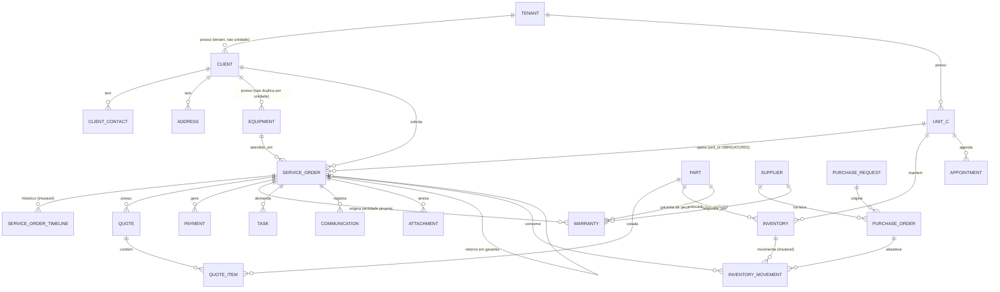

# ERD — Nexo56

Diagrama versionável em Mermaid (Prompt 02, item 83).

**Duas seções distintas:** o que existe fisicamente no banco e o que ainda é
apenas modelo conceitual.

---

## 1. Schema atual (implementado e migrado)

```mermaid
erDiagram
    PLANS ||--o{ PLAN_ENTITLEMENTS : libera
    FEATURES ||--o{ PLAN_ENTITLEMENTS : consta_em
    FEATURES ||--o{ FEATURE_DEPENDENCIES : depende
    FEATURES ||--o{ TENANT_FEATURES : configurada
    FEATURES ||--o{ PERMISSIONS : agrupa

    PLANS ||--o{ TENANTS : contratado_por
    TENANTS ||--o{ UNITS : possui
    TENANTS ||--o{ USERS : possui
    TENANTS ||--o{ ROLES : define
    TENANTS ||--o{ TENANT_FEATURES : ativa
    TENANTS ||--o{ TENANT_SEQUENCES : numera
    TENANTS ||--o{ AUDIT_LOGS : registra
    TENANTS ||--o{ DOMAIN_EVENTS : emite
    TENANTS ||--o{ JOBS : agenda

    USERS ||--o{ SESSIONS : autentica
    USERS ||--o{ USER_UNITS : autorizado_em
    UNITS ||--o{ USER_UNITS : autoriza
    USERS ||--o{ USER_ROLES : possui
    ROLES ||--o{ USER_ROLES : atribuido
    ROLES ||--o{ ROLE_PERMISSIONS : concede
    PERMISSIONS ||--o{ ROLE_PERMISSIONS : concedida

    TENANTS {
        char36 id PK
        varchar slug UK
        varchar name
        enum status
        varchar timezone
        char36 plan_id FK
    }
    UNITS {
        char36 id PK
        char36 tenant_id FK
        varchar name
        enum status
        varchar timezone "nulo herda do tenant"
        composite uq_units_id_tenant UK "alvo de FK composta"
    }
    USERS {
        char36 id PK
        char36 tenant_id FK
        varchar email "unico por tenant"
        varchar password_hash "scrypt"
        enum status
        composite uq_users_id_tenant UK "alvo de FK composta"
    }
    USER_UNITS {
        char36 user_id PK_FK "FK composta com tenant_id"
        char36 unit_id PK_FK "FK composta com tenant_id"
        char36 tenant_id FK
    }
    SESSIONS {
        char36 id PK
        char36 user_id FK "FK composta com tenant_id"
        char36 tenant_id FK
        varchar token_hash UK "SHA-256, nunca o token"
        datetime expires_at
        datetime revoked_at
    }
    ROLES {
        char36 id PK
        char36 tenant_id FK
        varchar key "unico por tenant"
        boolean is_system
        composite uq_roles_id_tenant UK "alvo de FK composta"
    }
    USER_ROLES {
        char36 user_id PK_FK "FK composta com tenant_id"
        char36 role_id PK_FK "FK composta com tenant_id"
        char36 tenant_id FK
    }
    PERMISSIONS {
        varchar key PK "catalogo GLOBAL"
        varchar feature_key FK
    }
    ROLE_PERMISSIONS {
        char36 role_id PK_FK
        varchar permission_key PK_FK
    }
    FEATURES {
        varchar key PK "catalogo GLOBAL"
        enum type "CORE OPTIONAL PREMIUM BETA INTERNAL"
        enum status
    }
    FEATURE_DEPENDENCIES {
        varchar feature_key PK_FK
        varchar depends_on_key PK_FK
    }
    PLANS {
        char36 id PK "catalogo GLOBAL"
        varchar key UK
        boolean is_internal
    }
    PLAN_ENTITLEMENTS {
        char36 plan_id PK_FK
        varchar feature_key PK_FK
    }
    TENANT_FEATURES {
        char36 tenant_id PK_FK
        varchar feature_key PK_FK
        boolean enabled "desativar NAO apaga dados"
        datetime enabled_at
        datetime disabled_at
    }
    TENANT_SEQUENCES {
        char36 tenant_id PK_FK
        varchar sequence_type PK "service_order quote..."
        bigint current_value "numeracao humana por tenant"
        varchar prefix
        int padding
    }
    AUDIT_LOGS {
        char36 id PK
        char36 tenant_id FK
        char36 user_id
        varchar action
        json before
        json after
        char36 correlation_id
    }
    DOMAIN_EVENTS {
        char36 id PK
        char36 tenant_id FK
        varchar type
        json payload
        datetime published_at "nulo = pendente (outbox)"
    }
    JOBS {
        char36 id PK
        varchar name
        char36 tenant_id FK
        varchar idempotency_key UK
        enum status
        int attempts
    }
```

### Destaques do diagrama

- `uq_units_id_tenant`, `uq_users_id_tenant` e `uq_roles_id_tenant` são as
  chaves compostas que permitem às FKs carregarem `tenant_id` junto. É o que
  torna **impossível no banco** associar entidades de tenants diferentes.
- `permissions`, `features`, `plans` e suas associações são **globais** — o
  catálogo do produto, idêntico para todos os tenants.

---

## 2. Modelo conceitual futuro (NÃO existe no banco)

> Nenhuma das entidades abaixo foi criada. Este diagrama existe para detectar
> conflito estrutural antes dos prompts funcionais (Prompt 02, item 48).



### Invariantes já decididas

| Decisão                                    | Motivo                                                            |
| ------------------------------------------ | ----------------------------------------------------------------- |
| `service_orders.unit_id` **obrigatório**   | A OS acontece fisicamente em uma unidade                          |
| `clients.unit_id` **não define ownership** | O mesmo cliente é atendido em qualquer filial                     |
| `equipments` pertence a tenant + cliente   | Não se duplica por passar em outra unidade                        |
| Número da OS **único por tenant**          | Sem ambiguidade em QR, portal, suporte e garantia                 |
| `warranties` é **entidade própria**        | Nunca um booleano dentro da OS (item 63)                          |
| `inventory` é **por unidade**              | Estoque é físico (item 64)                                        |
| `inventory_movements` é **imutável**       | Saldo sem histórico é saldo não auditável                         |
| `quotes` guarda **snapshot** de preço      | O que foi enviado ao cliente não muda se a tabela mudar (item 66) |
| `payments` usa **DECIMAL exato**           | Nunca float (item 65)                                             |
| `attachments` guarda **chave de storage**  | Binário não vai para tabela de negócio (item 60)                  |
