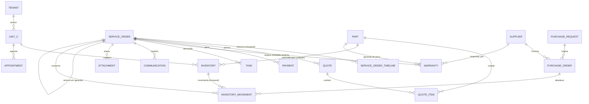

# ERD — Nexo56

Diagrama versionável em Mermaid (Prompt 02, item 83).

**Duas seções distintas:** o que existe fisicamente no banco e o que ainda é
apenas modelo conceitual.

---

## 1. Schema atual (implementado e migrado)

```mermaid
erDiagram
    PLANS ||--o{ PLAN_ENTITLEMENTS : libera
    FEATURES ||--o{ PLAN_ENTITLEMENTS : consta_em
    FEATURES ||--o{ FEATURE_DEPENDENCIES : depende
    FEATURES ||--o{ TENANT_FEATURES : configurada
    FEATURES ||--o{ PERMISSIONS : agrupa

    PLANS ||--o{ TENANTS : contratado_por
    TENANTS ||--o{ UNITS : possui
    TENANTS ||--o{ USERS : possui
    TENANTS ||--o{ ROLES : define
    TENANTS ||--o{ TENANT_FEATURES : ativa
    TENANTS ||--o{ TENANT_SEQUENCES : numera
    TENANTS ||--o{ AUDIT_LOGS : registra
    TENANTS ||--o{ DOMAIN_EVENTS : emite
    TENANTS ||--o{ JOBS : agenda

    USERS ||--o{ SESSIONS : autentica
    USERS ||--o{ USER_UNITS : autorizado_em
    UNITS ||--o{ USER_UNITS : autoriza
    USERS ||--o{ USER_ROLES : possui
    ROLES ||--o{ USER_ROLES : atribuido
    USERS ||--o{ USER_UNIT_ROLES : possui_na_unidade
    ROLES ||--o{ USER_UNIT_ROLES : atribuido_na_unidade
    UNITS ||--o{ USER_UNIT_ROLES : delimita
    USER_UNITS ||--o{ USER_UNIT_ROLES : exigido_por
    ROLES ||--o{ ROLE_PERMISSIONS : concede
    PERMISSIONS ||--o{ ROLE_PERMISSIONS : concedida
    USERS ||--o{ PASSWORD_RESET_TOKENS : redefine

    TENANTS ||--o{ CUSTOMERS : possui
    CUSTOMERS ||--o{ CUSTOMER_CONTACTS : tem
    CUSTOMERS ||--o{ CUSTOMER_ADDRESSES : tem
    CUSTOMERS ||--o{ EQUIPMENT : "possui (tenant, nao unidade)"
    EQUIPMENT ||--o{ EQUIPMENT_INTAKES : "recebido em"
    UNITS ||--o{ EQUIPMENT_INTAKES : "aconteceu na unidade"
    EQUIPMENT_INTAKES ||--o{ EQUIPMENT_INTAKE_ACCESSORIES : acompanha
    EQUIPMENT_INTAKES ||--o{ EQUIPMENT_INTAKE_CONDITIONS : inspeciona
    EQUIPMENT ||--o{ EQUIPMENT_MEDIA : fotografado
    EQUIPMENT_INTAKES ||--o{ EQUIPMENT_MEDIA : "foto do atendimento"
    EQUIPMENT ||--o{ EQUIPMENT_LABEL_READINGS : "etiqueta lida"

    CUSTOMERS ||--o{ SERVICE_ORDERS : solicita
    EQUIPMENT ||--o{ SERVICE_ORDERS : atendido_em
    UNITS ||--o{ SERVICE_ORDERS : "executa (unit_id OBRIGATORIO)"
    EQUIPMENT_INTAKES ||--o| SERVICE_ORDERS : "origina (1:1)"
    SERVICE_ORDERS ||--o{ SERVICE_ORDER_TIMELINE : "historico (append-only)"

    TENANTS {
        char36 id PK
        varchar slug UK
        varchar name
        enum status
        varchar timezone
        char36 plan_id FK
    }
    UNITS {
        char36 id PK
        char36 tenant_id FK
        varchar name
        enum status
        varchar timezone "nulo herda do tenant"
        composite uq_units_id_tenant UK "alvo de FK composta"
    }
    USERS {
        char36 id PK
        char36 tenant_id FK
        varchar email "unico por tenant"
        varchar password_hash "scrypt"
        enum status
        composite uq_users_id_tenant UK "alvo de FK composta"
    }
    USER_UNITS {
        char36 user_id PK_FK "FK composta com tenant_id"
        char36 unit_id PK_FK "FK composta com tenant_id"
        char36 tenant_id FK
    }
    SESSIONS {
        char36 id PK
        char36 user_id FK "FK composta com tenant_id"
        char36 tenant_id FK
        varchar token_hash UK "SHA-256, nunca o token"
        datetime expires_at
        datetime revoked_at
        varchar user_agent_summary "resumo curto, sem IP"
    }
    ROLES {
        char36 id PK
        char36 tenant_id FK
        varchar key "unico por tenant"
        boolean is_system
        composite uq_roles_id_tenant UK "alvo de FK composta"
    }
    USER_ROLES {
        char36 user_id PK_FK "FK composta com tenant_id"
        char36 role_id PK_FK "FK composta com tenant_id"
        char36 tenant_id FK
        escopo TENANT "vale nas unidades que o usuario acessa"
    }
    USER_UNIT_ROLES {
        char36 user_id PK_FK "FK composta com tenant_id e com unit_id"
        char36 role_id PK_FK "FK composta com tenant_id"
        char36 unit_id PK_FK "FK composta com tenant_id"
        char36 tenant_id FK
        escopo UNIT "vale SO nesta unidade; exige vinculo"
    }
    PASSWORD_RESET_TOKENS {
        char36 id PK
        char36 user_id FK "FK composta com tenant_id"
        char36 tenant_id FK
        varchar token_hash UK "SHA-256, nunca o codigo"
        datetime expires_at "60 minutos"
        datetime used_at "uso unico"
    }
    PERMISSIONS {
        varchar key PK "catalogo GLOBAL"
        varchar feature_key FK
    }
    ROLE_PERMISSIONS {
        char36 role_id PK_FK
        varchar permission_key PK_FK
    }
    FEATURES {
        varchar key PK "catalogo GLOBAL"
        enum type "CORE OPTIONAL PREMIUM BETA INTERNAL"
        enum status
    }
    FEATURE_DEPENDENCIES {
        varchar feature_key PK_FK
        varchar depends_on_key PK_FK
    }
    PLANS {
        char36 id PK "catalogo GLOBAL"
        varchar key UK
        boolean is_internal
    }
    PLAN_ENTITLEMENTS {
        char36 plan_id PK_FK
        varchar feature_key PK_FK
    }
    TENANT_FEATURES {
        char36 tenant_id PK_FK
        varchar feature_key PK_FK
        boolean enabled "desativar NAO apaga dados"
        datetime enabled_at
        datetime disabled_at
    }
    TENANT_SEQUENCES {
        char36 tenant_id PK_FK
        varchar sequence_type PK "service_order quote..."
        bigint current_value "numeracao humana por tenant"
        varchar prefix
        int padding
    }
    AUDIT_LOGS {
        char36 id PK
        char36 tenant_id FK
        char36 user_id
        varchar action
        json before
        json after
        char36 correlation_id
    }
    DOMAIN_EVENTS {
        char36 id PK
        char36 tenant_id FK
        varchar type
        json payload
        datetime published_at "nulo = pendente (outbox)"
    }
    JOBS {
        char36 id PK
        varchar name
        char36 tenant_id FK
        varchar idempotency_key UK
        enum status
        int attempts
    }
    CUSTOMERS {
        char36 id PK
        char36 tenant_id FK
        enum kind "individual company"
        varchar name
        varchar name_normalized "busca"
        varchar document_digits UK "unico por tenant quando presente"
        enum status
        char36 origin_unit_id "procedencia, NUNCA filtro"
        composite uq_customers_id_tenant UK "alvo de FK composta"
    }
    CUSTOMER_CONTACTS {
        char36 id PK
        char36 customer_id FK "FK composta com tenant_id"
        char36 tenant_id FK
        enum type "phone email"
        varchar value_normalized "busca"
        tinyint primary_marker UK "1 no principal, NULL nos demais"
    }
    CUSTOMER_ADDRESSES {
        char36 id PK
        char36 customer_id FK "FK composta com tenant_id"
        char36 tenant_id FK
        tinyint primary_marker UK "um unico principal"
    }
    EQUIPMENT {
        char36 id PK
        char36 tenant_id FK
        char36 customer_id FK "FK composta com tenant_id"
        varchar kind "texto livre com sugestoes"
        varchar brand
        varchar model "sem normalizacao destrutiva"
        varchar serial "OPCIONAL, sem unicidade"
        enum voltage "v110 v127 v220 bivolt not_applicable unknown"
        enum status
        char36 origin_unit_id "procedencia, NUNCA filtro"
        composite uq_equipment_id_tenant UK "alvo de FK composta"
    }
    EQUIPMENT_INTAKES {
        char36 id PK
        char36 tenant_id FK
        char36 unit_id FK "OBRIGATORIO, da sessao - FK composta"
        char36 equipment_id FK "FK composta com tenant_id"
        datetime received_at
        char36 received_by
        enum power_cable "yes no not_applicable"
        text inspection_notes "estado de entrada, NAO diagnostico"
        composite uq_intake_id_tenant UK "alvo de FK composta"
    }
    EQUIPMENT_INTAKE_ACCESSORIES {
        char36 id PK
        char36 intake_id FK "FK composta com tenant_id"
        varchar label "texto livre"
        int quantity "INTEIRA"
    }
    EQUIPMENT_INTAKE_CONDITIONS {
        char36 id PK
        char36 intake_id FK "FK composta com tenant_id"
        varchar condition_key UK "unico por recebimento"
        varchar note
    }
    EQUIPMENT_MEDIA {
        char36 id PK
        char36 tenant_id FK
        char36 equipment_id FK "FK composta com tenant_id"
        char36 intake_id FK "nulo = foto do cadastro"
        enum kind "label serial damage front back..."
        varchar storage_key "chave opaca; bytes FORA do banco"
        varchar checksum "SHA-256"
        composite uq_media_id_tenant UK "alvo de FK composta"
    }
    EQUIPMENT_LABEL_READINGS {
        char36 id PK
        char36 tenant_id FK
        char36 equipment_id FK "FK composta com tenant_id"
        varchar provider "none = indisponivel (padrao hoje)"
        enum status "succeeded partial failed unavailable"
        json fields "sugestao; NUNCA sobrescreve o confirmado"
        datetime confirmed_at "confirmacao HUMANA"
    }
    SERVICE_ORDERS {
        char36 id PK
        char36 tenant_id FK
        char36 unit_id FK "OBRIGATORIO, da sessao - FK composta"
        int number UK "numero humano, unico por TENANT"
        char36 customer_id FK "FK composta com tenant_id"
        char36 equipment_id FK "FK composta com tenant_id"
        char36 intake_id UK "nulo = sem recebimento; FK composta com tenant_id E com unit_id"
        varchar status "um dos nove estados do workflow; varchar, nunca ENUM"
        text customer_report "o que o CLIENTE disse - nao e diagnostico"
        text internal_notes "recado da equipe, nao vai ao cliente"
        datetime opened_at
        varchar idempotency_key UK "mesmo comando, mesma OS"
        datetime status_changed_at "P08 - instante da ultima transicao"
        int version "P08 - concorrencia otimista, compare-and-swap"
        char36 assigned_technician_id FK "P08 - FK composta com tenant_id"
        varchar follow_up_at "P08 - DATA CIVIL no fuso da empresa, nao instante"
        varchar follow_up_alerted_for "P08 - prazo que ja gerou evento"
        composite uq_service_order_id_tenant UK "alvo de FK composta"
    }
    SERVICE_ORDER_TIMELINE {
        char36 id PK
        char36 tenant_id FK
        char36 service_order_id FK "FK composta com tenant_id"
        varchar kind "nove tipos; texto, para crescer sem migration"
        varchar summary "sem PII"
        json metadata "sem PII - so chaves tecnicas"
        varchar reason "P08 - justificativa escrita da transicao"
        char36 actor_id
        datetime occurred_at
    }
    SERVICE_ORDER_TASKS {
        char36 id PK
        char36 tenant_id FK
        char36 unit_id FK "unidade da ordem - FK composta"
        char36 service_order_id FK "FK composta, ON DELETE CASCADE"
        varchar kind "delivery_preparation part_pickup - NAO e situacao da OS"
        varchar title "texto oficial, lido na bancada"
        varchar description "em part_pickup: texto livre"
        char36 assignee_id FK "nulo quando quem abriu perdeu acesso"
        varchar due_date "DATA CIVIL no fuso da empresa"
        varchar status "open done cancelled"
        tinyint open_marker UK "1 enquanto aberta, NULL depois"
        datetime completed_at
        char36 completed_by
    }
```

### Destaques do diagrama

- `uq_units_id_tenant`, `uq_users_id_tenant` e `uq_roles_id_tenant` são as
  chaves compostas que permitem às FKs carregarem `tenant_id` junto. É o que
  torna **impossível no banco** associar entidades de tenants diferentes.
- `permissions`, `features`, `plans` e suas associações são **globais** — o
  catálogo do produto, idêntico para todos os tenants.
- `USER_ROLES` e `USER_UNIT_ROLES` respondem à mesma pergunta em escopos
  diferentes: papel válido no tenant × papel válido só naquela unidade. O
  escopo pertence à **atribuição**, não ao perfil (ADR-019).
- A relação `USER_UNITS → USER_UNIT_ROLES` é a FK que torna o vínculo de
  unidade **pré-requisito no banco** para o papel de unidade (ADR-020).
- `CUSTOMERS` e `EQUIPMENT` são do **tenant**; `EQUIPMENT_INTAKES` é da
  **unidade**. Essa é a divisão que permite o mesmo aparelho ser atendido em
  lojas diferentes sem recadastro, e ainda assim cada loja ver só a própria
  fila (ADR-026, ADR-029).
- `EQUIPMENT_MEDIA` guarda `storage_key` e metadados; **os bytes ficam fora do
  banco**, num storage privado servido por rota autenticada (ADR-030).
- `EQUIPMENT_LABEL_READINGS` fica separada de `EQUIPMENT` de propósito: o
  cadastro guarda o que o humano confirmou, a leitura guarda o que foi
  sugerido (ADR-032).
- `SERVICE_ORDERS` é a primeira entidade **tenant + unidade** do sistema: o
  aparelho atravessa as lojas, o trabalho não (ADR-033). A FK composta
  `(intake_id, unit_id)` é o que impede, no banco, uma ordem carimbada em
  unidade diferente da do recebimento que a originou.
- `SERVICE_ORDER_TIMELINE` existe ao lado de `AUDIT_LOGS`, não no lugar dela:
  uma responde "o que aconteceu com este aparelho", a outra "quem alterou o
  quê".

---

## 2. Modelo conceitual futuro (NÃO existe no banco)

> Nenhuma das entidades abaixo foi criada. Este diagrama existe para detectar
> conflito estrutural antes dos prompts funcionais (Prompt 02, item 48).
>
> `CLIENT`, `EQUIPMENT` e `SERVICE_ORDER` aparecem abaixo apenas como **pontos
> de ligação**: os três já existem no banco (seção 1), como `customers`,
> `equipment` e `service_orders`. O mesmo vale para `CLIENT_CONTACT` e
> `ADDRESS`, hoje `customer_contacts` e `customer_addresses`.



### Invariantes já decididas

| Decisão                                    | Motivo                                                            |
| ------------------------------------------ | ----------------------------------------------------------------- |
| `service_orders.unit_id` **obrigatório**   | A OS acontece fisicamente em uma unidade                          |
| `clients.unit_id` **não define ownership** | O mesmo cliente é atendido em qualquer filial                     |
| `equipments` pertence a tenant + cliente   | Não se duplica por passar em outra unidade                        |
| Número da OS **único por tenant**          | Sem ambiguidade em QR, portal, suporte e garantia                 |
| `warranties` é **entidade própria**        | Nunca um booleano dentro da OS (item 63)                          |
| `inventory` é **por unidade**              | Estoque é físico (item 64)                                        |
| `inventory_movements` é **imutável**       | Saldo sem histórico é saldo não auditável                         |
| `quotes` guarda **snapshot** de preço      | O que foi enviado ao cliente não muda se a tabela mudar (item 66) |
| `payments` usa **DECIMAL exato**           | Nunca float (item 65)                                             |
| `attachments` guarda **chave de storage**  | Binário não vai para tabela de negócio (item 60)                  |
